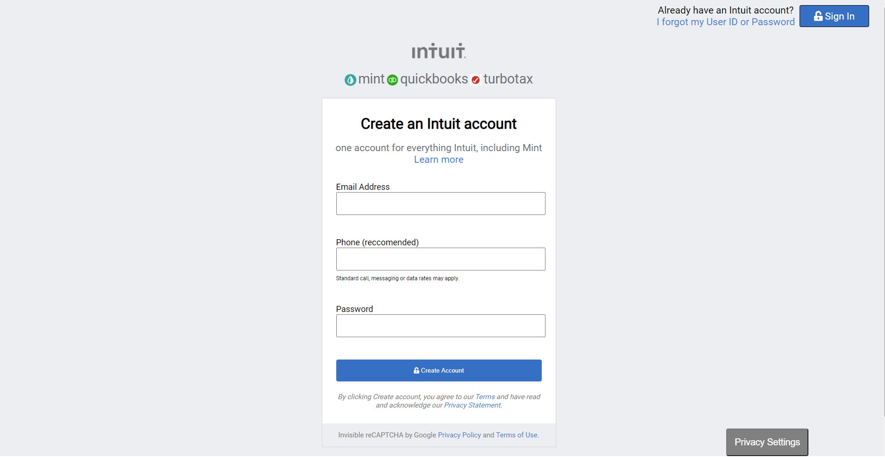

# HTML Form

A sign up page with a form made to emulate Mint. The form is made entirely in HTML and CSS.

## Built With

- HTML and CSS

## Live Demo

[Live Demo Link](https://raw.githack.com/sumon0002001/html_form/form/index.html)

## Getting Started

To get a local copy up and running follow these simple example steps.

### Prerequisites

One should have Google Chrome or a modern browser and any operating system such as Windows, Mac or Linux. 

### Setup

Download the zip or clone the repo and run index.html

## Authors

👤 **Author1**

- GitHub: [@sumon0002001](https://github.com/sumon0002001)
- Twitter: [@Sumon0002009](https://twitter.com/Sumon0002009)
- LinkedIn: [LinkedIn](https://www.linkedin.com/in/seteve-john-294a1318a/)

👤 **Author2**

- GitHub: [@Janluc](https://github.com/janluc)
- Twitter: [@Janluc123](https://twitter.com/Janluc123)
- LinkedIn: [LinkedIn](https://www.linkedin.com/in/janluc-saneaux-91707a1b4/)

## 🤝 Contributing

Contributions, issues, and feature requests are welcome!

Feel free to check the [issues page](issues/).

## Show your support

Give a ⭐️ if you like this project!

## 📝 License

This project is [MIT](lic.url) licensed.
